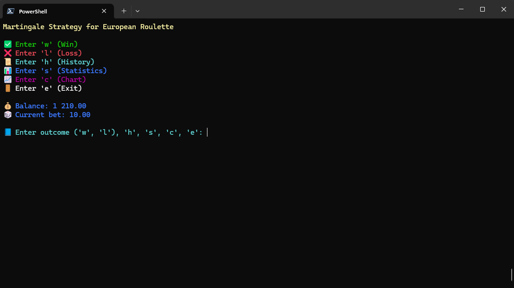

Here is the improved and more detailed `README.md` for the `betulator` repository:

# 🎲 Martingale Strategy Tracker for European Roulette

[](https://opensource.org/licenses/MIT)

**"Mathematics is the supreme judge; from its decisions, there is no appeal." — Tobias Dantzig**

But what happens when we pit mathematics against a spinning wheel of chance? Welcome to the **Martingale Strategy Tracker**—a tool designed to help you meticulously apply and monitor the **Martingale Strategy** in live European roulette.

If you’ve ever thought *"The house edge can’t defeat me if I double my bets!"*, this tracker is your companion. But remember: **Martingale is simple in concept, but risky in practice**.

Let’s dive into the **theory, math, and humor** behind one of the most famous (and flawed) betting systems in gambling history.

---

## 📜 Table of Contents

1. [What Is This Tool?](#-what-is-this-tool)
2. [Installation](#-installation)
3. [How to Use](#-how-to-use)
4. [Key Features](#-key-features)
5. [Why Martingale?](#-why-martingale)
6. [The Science of Martingale](#-the-science-of-martingale)
7. [Mathematical Foundations](#-mathematical-foundations)
8. [Probabilities and Risks](#-probabilities-and-risks)
9. [Advanced Concepts](#-advanced-concepts)
10. [Philosophical Musings](#-philosophical-musings)
11. [Compatibility](#-compatibility)
12. [Customization](#-customization)
13. [FAQs](#-faqs)
14. [License](#-license)
15. [Feedback and Contributions](#-feedback-and-contributions)

---

## 🎯 What Is This Tool?

The **Martingale Strategy Tracker** is a **bet-tracking and analysis tool** for live European roulette.  
It is designed to:
- **Track your bets in real-time**:
  - Automatically calculates your next bet size based on the Martingale progression.
  - Keeps an organized record of wins, losses, and bankroll changes.
- **Visualize your performance**:
  - Generates intuitive charts to display the rise and fall of your bankroll.
- **Analyze your strategy**:
  - Provides detailed statistics, such as ROI, win/loss ratios, and total wagers.

If the Martingale strategy is your sword, this tool is your scabbard, sharpening and organizing your approach.

---

## 🛠️ Installation

The **Martingale Strategy Tracker** works seamlessly on almost every modern operating system and device. Whether you’re on a **Windows PC**, a **Linux workstation**, or even a **mobile device**, this tool has you covered.

---

### ✅ Supported Platforms

1. **Windows**:  
   Works flawlessly on Command Prompt, PowerShell, or Windows Terminal.
2. **macOS/Linux**:  
   Compatible with any standard terminal application.
3. **Android**:  
   Run it on the go using [Termux](https://termux.dev/) or similar terminal emulators.

---

### 🛠️ Installation Steps

1. **Install Python 3.6+**  
   - Download Python from the [official website](https://www.python.org/).
   - Ensure `python` and `pip` are available in your terminal.

2. **Clone the Repository**  
   Open your terminal and execute:
   ```bash
   git clone https://github.com/NetBr3ak/betulator.git
   cd betulator
   ```

3. **Run the Program**  
   Start the tool by typing:
   ```bash
   python betulator.py
   ```

4. **Follow Prompts**  
   Enter your **initial bet** and **starting bankroll** to begin tracking your roulette gameplay.

---

### 📷 Visual Demonstrations

#### Example on Windows Terminal


#### Example on Android (Termux)


---

## 🎮 How to Use

### Step 1: Launch the Tool
Run the program using the command above. You’ll be greeted with prompts to enter your **initial bet size** and **starting bankroll**.

### Step 2: Play Roulette
Input the outcome of each round:
- **`w`**: Record a win.
- **`l`**: Record a loss.

### Step 3: View Progress
Use these commands during your session:
- **`h`**: View detailed bet history.
- **`s`**: Check your statistics.
- **`c`**: See a visual chart of your bankroll over time.
- **`e`**: Exit the program.

---

## 🌟 Key Features

### 1. 📜 Bet History
Keep track of every bet you place:
- Round number.
- Bet size.
- Result (win or loss).
- Balance change (delta).
- Current bankroll.

Example output:
```bash
📜 === Bet History ===
No   | Result | Bet    | Delta  | Balance
--------------------------------------------
1    | ✅ W   | 10.00  | +10.00 | 1010.00
2    | ❌ L   | 10.00  | -10.00 | 1000.00
3    | ❌ L   | 20.00  | -20.00 |  980.00
4    | ✅ W   | 40.00  | +40.00 | 1020.00
```

---

### 2. 📊 Detailed Statistics
Analyze your performance with aggregated metrics:
- **Total bets placed**.
- **Win/loss record**.
- **ROI (Return on Investment)**.
- **Net profit/loss**.

Example:
```bash
📊 === Statistics ===
💰 Total bets: 4
✅ Wins: 2
❌ Losses: 2
🎲 Total bet amount: 80.00
📘 ROI (Return on Investment): +20.00%
💰 Balance: 1020.00
```

---

### 3. 📈 Bankroll Chart
Visualize the trajectory of your bankroll. A bar chart plots your balance after each round, making it easy to identify trends.  
Example:
```bash
📈 === Bankroll Chart ===
Initial bankroll: 1000.00
Max bankroll: 1020.00
Min bankroll: 980.00
---------------------------------------------
  1000.00 | ███████
   980.00 | ████
  1020.00 | █████████████
---------------------------------------------
```

---

## 🤔 Why Martingale?

The **Martingale strategy** is seductive in its simplicity and promise:
1. **Guaranteed recovery**: After every win, you erase all previous losses and make a profit equal to your initial bet.
2. **Ease of execution**: Double your bet after every loss, reset to the initial bet after every win.

While the math behind Martingale is straightforward, its risks are significant. Let’s explore its inner workings.

---

## 🧠 The Science of Martingale

### How It Works
The strategy operates on a binary principle:
1. If you lose a bet, **double your wager** to recover previous losses.
2. If you win, **reset to your initial bet size**.

This progression ensures that every win results in a net profit. Mathematically, it can be summarized as:
```bash
Profit = b
```
where `b` is the initial bet.

### The Promise vs. Reality
The promise of Martingale is predicated on two assumptions:
1. **Infinite bankroll**: You can double your bets indefinitely.
2. **No table limits**: Casinos won’t cap your maximum bet size.

In reality, neither of these conditions is met, making Martingale a high-risk strategy.

---

## 🧮 Mathematical Foundations

### Bet Progression
After `L` consecutive losses, the next bet is:
```bash
b_next = b * 2^L
```

### Total Wagered
The total amount wagered after `L` losses:
```bash
total_wagered = b * (2^L - 1)
```

### Net Profit
If you win after `L` losses, your profit is always equal to the initial bet:
```bash
profit = b
```

---

## 📊 Probabilities and Risks

### Winning Probability in European Roulette
European roulette has 18 red numbers, 18 black numbers, and 1 green zero. The green zero is what gives the house its edge.

The probability of winning a bet on red or black:
```bash
P(win) = 18 / 37 ≈ 48.65%
```

This means **your odds of losing are slightly higher**:
```bash
P(lose) = 19 / 37 ≈ 51.35%
```

### Losing Streak Probability
The likelihood of encountering a losing streak increases dramatically as the number of losses (`L`) grows.

Formula:
```bash
P(loss_streak) = (19 / 37)^L
```

Examples:
- Probability of losing 5 times in a row:
  ```bash
  P(loss_streak_5) = (19 / 37)^5 ≈ 2.18%
  ```

- Probability of losing 10 times in a row:
  ```bash
  P(loss_streak_10) = (19 / 37)^10 ≈ 0.048%
  ```

### Expected Loss: The House Edge
The **house edge** in European roulette ensures that, on average, the casino takes 2.7% of every bet you place. This is why Martingale cannot overcome the system in the long run.

Formula:
```bash
Expected_loss = Total_wagered * House_edge
```

Example:
- Total wagered = €1,000
- Expected loss:
  ```bash
  Expected_loss = 1,000 * 0.027 = €27
  ```

---

## 🔢 Advanced Concepts

### Risk of Ruin
Risk of Ruin measures the likelihood of depleting your bankroll entirely before you achieve a win. It depends on:
- **Starting bankroll** (`B`).
- **Initial bet size** (`b`).
- **House edge** (`e`).

Formula:
```bash
Risk_of_Ruin = (1 - e)^(B / b)
```

Example:
- Starting bankroll = €1,000
- Initial bet = €10
- House edge = 0.027
  ```bash
  Risk_of_Ruin = (1 - 0.027)^(1000 / 10) ≈ 5.04%
  ```

### Exponential Growth of Bets
Martingale’s simplicity hides an inconvenient truth: your bets grow **exponentially** after each loss.

If your starting bet is €10:
- After 5 losses: €320
- After 10 losses: €10,240

### Casino Table Limits
Most casinos impose table limits to prevent Martingale abuse. Example:
- Minimum bet: €10
- Maximum bet: €500

In this scenario:
- Starting at €10, you hit the table limit after 5 losses.
  ```bash
  b_next = 10 * 2^5 = €320 (allowed)
  b_next = 10 * 2^6 = €640 (not allowed)
  ```

If your loss streak exceeds the table limit, the strategy collapses.

### Expected Value (EV)
The expected value of a Martingale progression combines the probabilities of winning and losing streaks:
```bash
EV = (P(win) * Profit) - (P(lose) * Loss)
```

Example:
- Initial bet (`b`) = €10
- Probability of winning (`P(win)`) = 48.65%
- Probability of losing (`P(lose)`) = 51.35%
- Loss after 5 streaks = €310
  ```bash
  EV = (0.4865 * 10) - (0.5135 * 310) ≈ -€5.31
  ```

Even with Martingale, the **expected value remains negative**, favoring the casino.

---

## 🤔 Philosophical Musings

### Why Are We Drawn to Martingale?
Humans are **wired to believe in patterns**, even in systems that are entirely random. The Martingale strategy exploits:
1. **The Gambler's Fallacy**: The false belief that past outcomes influence future ones.
   - "After 5 losses, surely the next spin must be a win!"
2. **Psychological Comfort**: Doubling down feels proactive, like you’re taking control of the situation.
3. **Survivorship Bias**: People who win big using Martingale often tell their stories, while those who go broke remain silent.

### The Illusion of Control
Martingale gives the illusion that with enough persistence, you can “force” a win. But in reality, roulette is a system governed by **randomness**, where the outcome of each spin is **independent** of the previous one.

---

## 🌍 Compatibility

This tool works on virtually any modern platform:
- **Windows**: Use Command Prompt, PowerShell, or Windows Terminal.
- **macOS/Linux**: Compatible with all standard terminal applications.
- **Android**: Run it on the go using Termux.

---

## 🔧 Customization

Feel like tweaking the tool? You can:
1. **Experiment with Alternative Strategies**:
   - Fibonacci: A safer progression that increases bets more gradually.
   - Kelly Criterion: Bet proportionally based on your perceived edge.
2. **Add Realistic Constraints**:
   - Implement table limits.
   - Adjust starting bankrolls and bet increments.
3. **Extend Features**:
   - Simulate thousands of rounds to analyze long-term outcomes.

---

## 💬 FAQs

### Q1: Can Martingale guarantee a profit?
No. While the strategy can deliver **short-term wins**, it collapses under prolonged losing streaks or table limits.

### Q2: Is this tool a simulator?
No. This tool tracks your bets and progress during live games. It does not simulate spins or predict outcomes.

### Q3: Can I use this tool for other games?
Yes! The principles apply to any game with binary outcomes, such as coin flips or blackjack side bets.

---

## 📜 License

This project is licensed under the [MIT License](LICENSE). Feel free to modify, share, and use responsibly.

---

## 💬 Feedback and Contributions

Have ideas to make this tool even better? Found a bug? Open an issue or submit a pull request.

And remember: **"In gambling, math is your friend—but only if you know when to quit."** 😉
